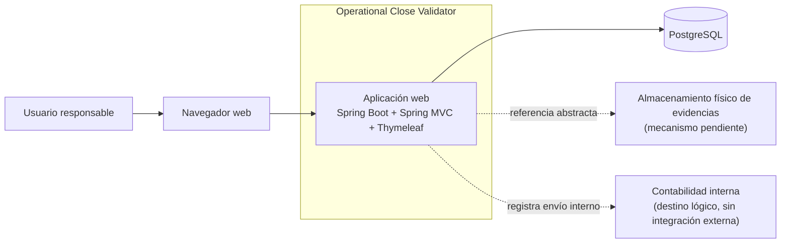
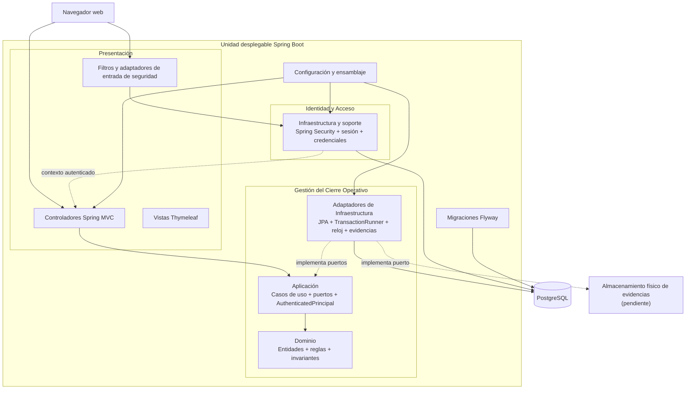
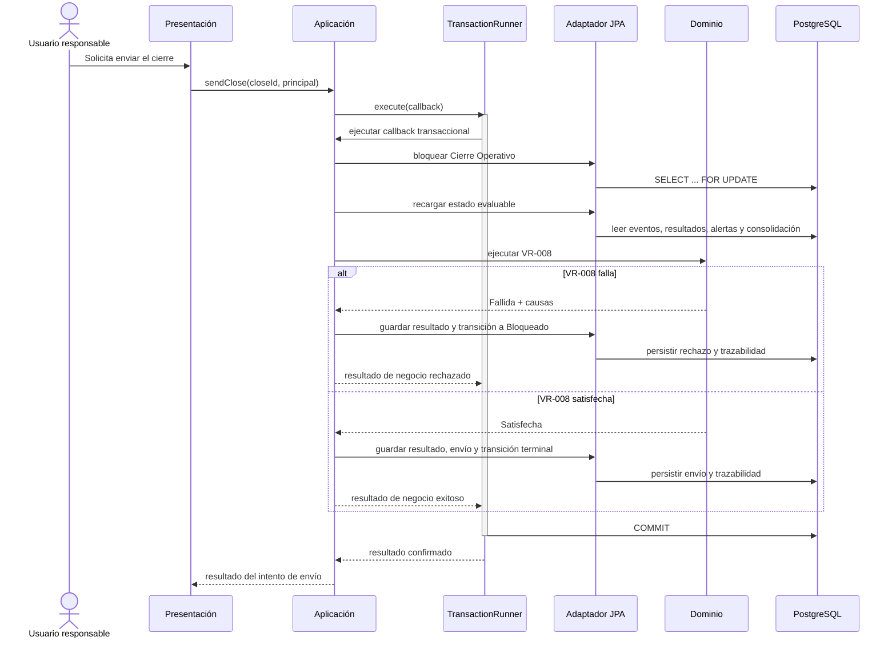

# Visión General de Arquitectura

**Versión:** v0.1

**Estado:** Línea base aprobada

**Fase:** 05 — Diseño técnico

**Producto:** Operational Close Validator

---

## 1. Propósito

Este documento integra las decisiones arquitectónicas aceptadas en ADR-0001 a ADR-0005 y describe cómo se organizan, relacionan y ejecutan los componentes del MVP de Operational Close Validator.

Su propósito es proporcionar una vista coherente del sistema que guíe el diseño detallado y la implementación, manteniendo:

- los límites de negocio aprobados;
- la dirección de dependencias definida;
- la consistencia transaccional de las operaciones críticas;
- la independencia del Dominio respecto de frameworks y persistencia;
- una sola unidad desplegable de aplicación;
- la simplicidad operativa requerida para el MVP.

Este documento no introduce tecnologías, patrones ni funcionalidades adicionales a las decisiones ya aceptadas.

No define el esquema físico de datos, contratos HTTP detallados, clases, paquetes definitivos, configuración completa de seguridad, estrategia de pruebas ni estrategia de despliegue. Esos aspectos se documentarán en artefactos posteriores.

---

## 2. Alcance

### 2.1. Incluye

- contexto del sistema y actores;
- estilo arquitectónico seleccionado;
- unidad desplegable y dependencias externas;
- módulos por capacidad de negocio;
- responsabilidades de Presentación, Aplicación, Dominio e Infraestructura;
- dirección permitida de las dependencias;
- integración entre Gestión del Cierre Operativo e Identidad y Acceso;
- estrategia general de persistencia;
- estrategia general de autenticación y sesión;
- límite de consistencia de VR-008;
- flujo general de invalidación, revalidación, consolidación y envío;
- principios e invariantes arquitectónicas;
- decisiones pendientes que no deben resolverse mediante suposiciones.

### 2.2. No incluye

- tablas, columnas, índices y tipos físicos;
- contratos detallados de endpoints;
- formatos definitivos de solicitudes y respuestas;
- estructura física final de paquetes y clases;
- diseño visual detallado de la interfaz;
- política completa de seguridad HTTP;
- estrategia detallada de pruebas;
- proveedor y topología final de despliegue;
- pipelines de integración y entrega;
- monitoreo, métricas y alertas operativas;
- almacenamiento físico definitivo de Evidencias de Soporte;
- integraciones contables externas;
- reapertura de cierres enviados.

Estos elementos se documentarán en `data-model.md`, `api-design.md`, `security-design.md`, `testing-strategy.md`, `deployment-strategy.md` o mediante una decisión adicional cuando corresponda.

---

## 3. Decisiones arquitectónicas integradas

| Decisión | Resultado integrado |
|---|---|
| ADR-0001 | Una falla de VR-008 inmediatamente antes del envío rechaza la operación y devuelve el cierre de Validado a Bloqueado. |
| ADR-0002 | La aplicación es un monolito modular por capacidades con puertos y adaptadores, desplegado como una sola unidad. |
| ADR-0003 | El stack del MVP es Java, Spring Boot, Spring MVC, Thymeleaf y Maven. |
| ADR-0004 | La persistencia utiliza PostgreSQL, Spring Data JPA con Hibernate, Flyway, transacciones explícitas y bloqueo pesimista por Cierre Operativo. |
| ADR-0005 | La autenticación utiliza Spring Security, form login y sesión HTTP del servidor para un único usuario preconfigurado. |

Las decisiones se complementan de la siguiente manera:

```text
ADR-0001
define el comportamiento crítico del envío
        ↓
ADR-0002
define la arquitectura y el límite local de consistencia
        ↓
ADR-0003
selecciona el stack de aplicación
        ↓
ADR-0004
materializa persistencia, transacciones y concurrencia
        ↓
ADR-0005
materializa autenticación, sesión y principal autenticado
```

---

## 4. Resumen arquitectónico

Operational Close Validator es una aplicación web para registrar, validar, corregir, consolidar y enviar internamente un Cierre Operativo a contabilidad.

La aplicación se implementa como un **monolito modular por capacidades con puertos y adaptadores**.

El sistema contiene dos módulos principales:

- **Gestión del Cierre Operativo:** módulo núcleo que contiene el comportamiento operativo y las invariantes del producto.
- **Identidad y Acceso:** módulo de soporte con alcance reducido, responsable del usuario preconfigurado, autenticación y sesión.

La unidad desplegable contiene:

- backend Spring Boot;
- controladores Spring MVC;
- vistas Thymeleaf;
- recursos estáticos;
- módulos internos;
- adaptadores de Infraestructura;
- configuración de seguridad;
- configuración de persistencia.

Las dependencias externas de la aplicación son:

- PostgreSQL;
- navegador web;
- almacenamiento físico de Evidencias de Soporte, cuando se seleccione su mecanismo definitivo.

El envío a contabilidad no constituye una integración externa. En el MVP es un registro interno y una transición terminal del Cierre Operativo.

---

## 5. Contexto del sistema

### 5.1. Actor humano

#### Usuario responsable

Es el único actor humano del MVP.

Puede:

- iniciar y cerrar sesión;
- registrar Eventos Operativos;
- modificar o corregir eventos;
- asociar Evidencias de Soporte;
- registrar Autorizaciones;
- ejecutar validaciones;
- gestionar Alertas;
- consolidar el cierre;
- solicitar el envío interno a contabilidad;
- consultar estados y trazabilidad.

El sistema utiliza una identidad interna estable:

```text
userId: responsible-user
```

No existen usuarios adicionales, roles técnicos configurables ni una matriz de permisos dentro del MVP.

### 5.2. Destino lógico

#### Contabilidad interna

Contabilidad interna es el destino de negocio del cierre, pero no es:

- un usuario autenticado del MVP;
- un sistema externo integrado;
- un servicio remoto;
- una cola;
- una API de terceros.

El envío se representa mediante:

- ejecución de VR-008;
- registro interno del resultado;
- registro de fecha, hora y responsable;
- transición del cierre a Enviado a contabilidad.

### 5.3. Responsabilidades del sistema

Operational Close Validator es responsable de:

- autenticar al usuario responsable;
- registrar Eventos Operativos de tipo Ingreso, Egreso, Descuento y Anulación;
- ejecutar VR-001, VR-002, VR-003 y VR-006;
- conservar Resultados de Validación y su vigencia;
- generar y gestionar Alertas;
- conservar Evidencias de Soporte y Autorizaciones;
- invalidar resultados y consolidaciones cuando cambien datos relevantes;
- mantener las máquinas de estado aprobadas;
- consolidar el cierre;
- ejecutar VR-008 inmediatamente antes del envío;
- impedir envíos inconsistentes;
- mantener trazabilidad de acciones, estados, resultados e intentos de envío.

### 5.4. Dependencias externas aprobadas

#### Navegador web

Es el cliente interactivo del usuario.

Utiliza:

- HTML renderizado en servidor;
- formularios HTTP;
- recursos CSS y JavaScript;
- cookie de sesión;
- tokens CSRF.

#### PostgreSQL

Es la única base de datos relacional de la aplicación.

Conserva:

- información operativa;
- resultados y vigencia;
- Alertas;
- consolidaciones;
- trazabilidad;
- registro interno de envío;
- usuario preconfigurado y hash de credencial;
- metadatos y referencia abstracta de Evidencias de Soporte.

### 5.5. Dependencia pendiente

#### Almacenamiento físico de Evidencias de Soporte

La arquitectura define un puerto abstracto para el almacenamiento físico de Evidencias de Soporte.

La base relacional conserva:

- metadatos;
- relación con el Evento Operativo;
- vigencia;
- fechas y responsable;
- referencia abstracta al contenido.

Este documento no decide si el contenido físico se almacenará en:

- sistema de archivos persistente;
- almacenamiento de objetos;
- servicio administrado;
- otra alternativa.

No se debe asumir que los binarios se almacenarán en PostgreSQL.

---

## 6. Diagrama de contexto



La flecha hacia Contabilidad interna no representa una llamada de red. Representa una transición de negocio y un registro persistente dentro de Operational Close Validator.

---

## 7. Estilo arquitectónico

### 7.1. Monolito modular por capacidades

La aplicación se ejecuta como una sola unidad, pero sus responsabilidades se separan mediante módulos internos por capacidad de negocio.

Esto permite:

- mantener VR-008 dentro de un único límite local de consistencia;
- proteger las invariantes del Cierre Operativo;
- evitar coordinación distribuida;
- localizar los cambios;
- probar el Dominio de forma aislada;
- mantener una operación y un despliegue simples.

Los módulos no son:

- microservicios;
- procesos independientes;
- aplicaciones desplegables separadas;
- propietarios de bases de datos independientes.

### 7.2. Puertos y adaptadores

Aplicación define los puertos de salida requeridos por sus casos de uso.

Ejemplos:

- repositorios;
- `TransactionRunner`;
- reloj;
- almacenamiento físico de Evidencias de Soporte;
- acceso al principal autenticado cuando corresponda.

Infraestructura implementa esos puertos.

El Dominio no define puertos técnicos de persistencia ni depende de sus implementaciones.

### 7.3. Dirección de dependencias

```text
Adaptadores de entrada → Aplicación → Dominio

Adaptadores de salida → Puertos definidos por Aplicación
```

Reglas obligatorias:

1. Presentación puede depender de Aplicación.
2. Aplicación puede depender del Dominio.
3. Infraestructura puede depender de contratos de Aplicación.
4. El Dominio no depende de Presentación, Aplicación técnica ni Infraestructura.
5. Aplicación no depende de controladores, Thymeleaf, JPA, Hibernate ni Spring Security.
6. Gestión del Cierre Operativo no depende de la implementación interna de Identidad y Acceso.
7. Identidad y Acceso no depende de Gestión del Cierre Operativo.
8. La composición de dependencias ocurre fuera del Dominio.

### 7.4. Capas como responsabilidades, no como estructura artificial

Presentación, Aplicación, Dominio e Infraestructura representan responsabilidades arquitectónicas.

No se exige crear paquetes, interfaces o clases vacías para mantener una simetría visual.

Identidad y Acceso es un módulo de soporte reducido y no necesita un modelo de dominio complejo si sus reglas no lo justifican.

---

## 8. Unidad desplegable

La construcción produce una única aplicación Spring Boot.

La unidad desplegable contiene:

```text
Aplicación Spring Boot
├── Controladores Spring MVC
├── Vistas Thymeleaf
├── Recursos estáticos
├── Gestión del Cierre Operativo
│   ├── Aplicación
│   ├── Dominio
│   └── Adaptadores
├── Identidad y Acceso
│   ├── Contratos de Aplicación
│   └── Adaptadores
├── Configuración y ensamblaje
└── Migraciones Flyway
```

La unidad desplegable no contiene:

- PostgreSQL;
- el contenido físico definitivo de Evidencias de Soporte;
- un sistema contable externo;
- un proveedor de identidad externo.

El artefacto principal se construye mediante Maven y debe incluir backend, plantillas y recursos web en una misma versión.

El despliegue inicial utiliza una sola instancia de aplicación. Escalar horizontalmente requiere revisar la estrategia de sesión en memoria y otras decisiones operativas.

---

## 9. Estructura lógica

### 9.1. Presentación

#### Componentes

- controladores Spring MVC;
- vistas Thymeleaf;
- formularios;
- validación de entrada;
- manejo de navegación;
- página de login;
- adaptación del principal técnico;
- presentación de estados y errores.

#### Responsabilidades

- recibir solicitudes HTTP;
- validar estructura y formato de entrada;
- delegar en casos de uso;
- transformar modelos de presentación;
- mostrar resultados;
- integrar tokens CSRF;
- adaptar el objeto técnico de Spring Security a `AuthenticatedPrincipal`.

#### Restricciones

Presentación no:

- implementa reglas de validación del negocio;
- decide transiciones de estado;
- abre o confirma transacciones;
- accede directamente a repositorios JPA;
- ejecuta VR-008;
- utiliza entidades JPA como modelos de vista;
- conserva estado de negocio en la sesión.

### 9.2. Aplicación

#### Componentes

- casos de uso;
- comandos y resultados de aplicación;
- puertos de salida;
- contrato `AuthenticatedPrincipal`;
- coordinación transaccional mediante `TransactionRunner`.

#### Responsabilidades

- coordinar los casos de uso;
- cargar entidades mediante puertos;
- invocar reglas del Dominio;
- definir el límite de consistencia;
- decidir qué efectos deben persistirse juntos;
- coordinar invalidación, revalidación y consolidación;
- exigir un principal autenticado;
- traducir resultados de negocio a respuestas de aplicación.

#### Restricciones

Aplicación:

- no contiene lógica de interfaz;
- no depende de JPA, Hibernate, Thymeleaf ni controladores;
- no recibe `Authentication`, `SecurityContext`, `HttpSession` ni `UserDetails`;
- no abre conexiones;
- no utiliza `EntityManager`;
- no expone excepciones de persistencia;
- no realiza llamadas externas dentro de una transacción crítica.

### 9.3. Dominio

#### Componentes

- Cierre Operativo;
- Evento Operativo;
- Evidencia de Soporte;
- Autorización;
- Resultado de Validación;
- Alerta;
- consolidación;
- reglas VR-001, VR-002, VR-003, VR-006 y VR-008;
- objetos de valor;
- invariantes;
- transiciones de estado.

#### Responsabilidades

- representar las reglas del negocio;
- validar transiciones;
- evaluar reglas;
- determinar estados válidos;
- determinar cuándo un resultado deja de estar vigente;
- proteger las invariantes;
- producir resultados deterministas y verificables.

#### Restricciones

El Dominio no depende de:

- Spring;
- Spring MVC;
- Spring Security;
- JPA;
- Hibernate;
- PostgreSQL;
- Flyway;
- HTTP;
- cookies;
- sesiones;
- sistema de archivos;
- almacenamiento de objetos;
- detalles de despliegue.

Las entidades del Dominio no contienen anotaciones de persistencia.

### 9.4. Infraestructura

#### Componentes

- entidades JPA;
- repositorios Spring Data;
- adaptadores de persistencia;
- mapeadores entre JPA y Dominio;
- `TransactionRunner` implementado mediante `TransactionTemplate`;
- configuración de PostgreSQL;
- migraciones Flyway;
- adaptador de reloj;
- adaptador de Evidencias de Soporte;
- Spring Security;
- `UserDetailsService`;
- `PasswordEncoder`;
- sesión HTTP;
- configuración y ensamblaje.

#### Responsabilidades

- implementar puertos definidos por Aplicación;
- persistir y recuperar información;
- materializar transacciones;
- adquirir bloqueos;
- traducir errores técnicos;
- autenticar al usuario;
- gestionar la sesión;
- aplicar migraciones;
- conectar dependencias técnicas.

#### Restricciones

Infraestructura:

- no define reglas del negocio;
- no decide transiciones por sí sola;
- no expone entidades JPA al Dominio;
- no modifica datos de otro módulo sin un contrato explícito;
- no utiliza generación automática de esquema como mecanismo de evolución.

---

## 10. Módulos por capacidad

### 10.1. Gestión del Cierre Operativo

Es el módulo núcleo.

#### Responsabilidades

- crear y modificar Cierres Operativos;
- registrar Eventos Operativos;
- gestionar Evidencias de Soporte;
- gestionar Autorizaciones;
- ejecutar validaciones;
- conservar Resultados de Validación;
- invalidar resultados no vigentes;
- generar y gestionar Alertas;
- consolidar cierres;
- ejecutar VR-008;
- registrar el envío interno;
- mantener trazabilidad operativa.

#### Propiedad lógica de información

- Cierres Operativos;
- Eventos Operativos;
- Evidencias de Soporte y sus referencias;
- Autorizaciones;
- Resultados de Validación;
- Alertas;
- consolidaciones;
- registros internos de envío;
- transiciones y auditoría operativa.

#### Límite crítico

VR-008, las entidades evaluadas, la transición del cierre y el registro del envío permanecen dentro de este módulo y comparten un límite local de consistencia.

No se separan Validaciones, Alertas, consolidación o envío en módulos transaccionales independientes.

### 10.2. Identidad y Acceso

Es un módulo de soporte con alcance reducido.

#### Responsabilidades

- aprovisionar el único usuario;
- sincronizar las credenciales externas;
- autenticar al usuario;
- gestionar la sesión HTTP;
- limitar sesiones concurrentes;
- aplicar protección CSRF y de fijación de sesión;
- registrar eventos de seguridad;
- adaptar el principal técnico.

#### Propiedad lógica persistente

- usuario `responsible-user`;
- nombre de usuario;
- hash de contraseña;
- estado habilitado;
- versión de credencial;
- fechas de aprovisionamiento y actualización;
- trazabilidad de seguridad cuando corresponda.

#### Estado técnico temporal

La sesión HTTP:

- permanece en memoria del proceso;
- no forma parte del modelo de negocio;
- no se persiste en PostgreSQL;
- se invalida al reiniciar la aplicación;
- no contiene agregados ni estado operativo.

### 10.3. Relación entre módulos

La interacción aprobada es:

```text
Spring Security
        ↓ autentica
Adaptador de entrada
        ↓ transforma
AuthenticatedPrincipal
        ↓ entrega
Caso de uso de Gestión del Cierre Operativo
```

`AuthenticatedPrincipal` contiene:

```text
userId
username
```

Gestión del Cierre Operativo utiliza `userId` para:

- identificar al usuario responsable;
- atribuir responsabilidad;
- mantener trazabilidad;
- registrar acciones.

La autorización mínima se verifica en el límite de Aplicación mediante la presencia de un `AuthenticatedPrincipal` válido. `userId` no representa un rol ni un permiso.

El módulo no conoce:

- Spring Security;
- `UserDetails`;
- `SecurityContext`;
- cookies;
- sesión HTTP;
- algoritmos de contraseña.

---

## 11. Diagrama de componentes



Las flechas de implementación no permiten que Aplicación dependa de clases concretas de Infraestructura.

---

## 12. Persistencia y propiedad de datos

### 12.1. Estrategia general

La aplicación utiliza:

- una única base de datos PostgreSQL;
- una única fuente de datos lógica;
- un pool de conexiones;
- propiedad lógica por módulo;
- transacciones locales;
- ausencia de coordinación distribuida.

La base de datos no constituye un módulo de negocio.

### 12.2. Adaptador de persistencia

La persistencia utiliza:

- Spring Data JPA;
- Hibernate;
- driver JDBC de PostgreSQL;
- entidades JPA dentro de Infraestructura;
- mapeo explícito entre modelos persistentes y Dominio.

Separación obligatoria:

```text
Dominio
Entidades y reglas sin JPA
        ↕ mapeo explícito
Infraestructura
Entidades JPA y repositorios Spring Data
```

Las entidades JPA no:

- son entidades del Dominio;
- se exponen a Presentación;
- se utilizan como contratos de Aplicación.

### 12.3. Migraciones

Flyway es el único mecanismo de creación y evolución del esquema.

Las migraciones:

- se versionan en Git;
- utilizan SQL determinista;
- se ejecutan desde una base vacía;
- incorporan restricciones e índices;
- no se modifican después de aplicarse en entornos compartidos;
- forman parte del despliegue reproducible.

Hibernate:

- valida el esquema;
- no crea tablas;
- no actualiza automáticamente la estructura.

Open EntityManager in View permanece deshabilitado.

### 12.4. Restricciones relacionales

La base debe aplicar, como mínimo:

- claves primarias;
- claves foráneas;
- nulabilidad;
- unicidad;
- integridad estructural;
- máximo un envío exitoso por cierre;
- índices requeridos por los casos de uso.

Las restricciones relacionales refuerzan las invariantes, pero no sustituyen las reglas del Dominio.

---

## 13. Transacciones y concurrencia

### 13.1. Límite transaccional

Aplicación define qué operación debe ejecutarse de forma atómica.

Infraestructura materializa el límite mediante:

```text
TransactionRunner → TransactionTemplate
```

Los controladores no contienen `@Transactional` para coordinar casos de uso de negocio.

### 13.2. Puerta de concurrencia

Toda operación que pueda modificar información relevante de un cierre adquiere primero un bloqueo exclusivo sobre la fila del Cierre Operativo.

La estrategia utiliza:

- PostgreSQL;
- aislamiento inicial `READ_COMMITTED`;
- bloqueo pesimista `PESSIMISTIC_WRITE`;
- orden de bloqueo estable;
- transacciones breves;
- ausencia de reintentos automáticos en el MVP.

El orden obligatorio es:

```text
1. Cierre Operativo
2. Entidades dependientes
3. Registros de trazabilidad
```

### 13.3. Operaciones sujetas al bloqueo

- modificación de Eventos Operativos;
- modificación de Evidencias de Soporte;
- modificación de Autorizaciones;
- actualización de Resultados de Validación;
- gestión de Alertas bloqueantes;
- consolidación;
- cambios de estado del cierre;
- intento de envío;
- registro interno de envío.

### 13.4. Trabajo prohibido dentro de la transacción

- llamadas de red;
- correos;
- procesamiento prolongado de archivos;
- esperas de usuario;
- operaciones no necesarias para decidir y persistir el caso de uso.

---

## 14. Flujo crítico de VR-008 y envío

### 14.1. Protocolo

```text
1. Iniciar transacción.
2. Bloquear el Cierre Operativo.
3. Rechazar si ya está Enviado a contabilidad.
4. Recargar Eventos Operativos.
5. Recargar Resultados de Validación vigentes.
6. Recargar Alertas bloqueantes.
7. Recargar la consolidación.
8. Ejecutar VR-008.
9. Persistir el resultado, la transición y la trazabilidad.
10. Confirmar el resultado de negocio, tanto exitoso como rechazado.
11. Revertir la transacción únicamente ante un error técnico o un conflicto que impida persistir el resultado de forma consistente.
```

### 14.2. Resultado fallido

Cuando VR-008 falla:

- el envío se rechaza;
- VR-008 queda Fallida;
- se registra causa y entidades afectadas;
- se registran fecha, hora y responsable;
- el cierre pasa de Validado a Bloqueado;
- no se registra un envío exitoso;
- se confirma el rechazo y el nuevo estado de negocio;
- se exige corrección;
- se exige revalidación;
- se exige una nueva consolidación antes de volver a Validado.

La falla de VR-008 no debe lanzarse como una excepción técnica que revierta el estado Bloqueado y elimine la trazabilidad del rechazo.

### 14.3. Resultado exitoso

Cuando VR-008 se satisface:

- se registra el Resultado de Validación vigente;
- se registran fecha, hora y responsable;
- se crea un único registro interno de envío;
- el cierre pasa a Enviado a contabilidad;
- la transacción se confirma.

Enviado a contabilidad es terminal dentro del MVP.

### 14.4. Secuencia



---

## 15. Invalidación y revalidación

Cuando cambia información relevante de un Evento Operativo:

1. los Resultados de Validación dependientes quedan no vigentes;
2. un evento previamente Validado pasa a Registrado;
3. un cierre previamente Validado pasa a Bloqueado;
4. la consolidación afectada queda no vigente;
5. las reglas aplicables deben ejecutarse nuevamente mediante el flujo de revalidación;
6. la revalidación determina el nuevo estado real del Evento Operativo;
7. el cierre solo puede regresar a Validado cuando todas las condiciones vuelven a cumplirse.

Información relevante incluye:

- monto;
- tipo;
- responsable;
- motivo;
- Evidencia de Soporte;
- Autorización;
- datos utilizados por una regla;
- estado de una Alerta bloqueante;
- datos de consolidación.

No se conserva una validación histórica como vigente después de modificar sus datos de origen.

---

## 16. Consolidación

La consolidación calcula y conserva, como mínimo:

- totales por tipo de Evento Operativo;
- saldo inicial;
- saldo esperado;
- saldo real;
- diferencia;
- fecha y hora;
- usuario responsable;
- vigencia.

Solo puede completarse cuando:

- todos los Eventos Operativos están Validados;
- no existen Alertas bloqueantes activas;
- todos los Resultados de Validación aplicables están vigentes y satisfechos.

La consolidación queda no vigente cuando cambia cualquier dato de origen relevante.

Después de una falla de VR-008, se requiere una nueva consolidación antes de que el cierre pueda volver a Validado.

---

## 17. Alertas

Los estados de una Alerta son:

```text
Activa
Reconocida
En revisión
Resuelta
Descartada
```

Reglas:

- una validación fallida o condición bloqueante puede generar una Alerta;
- Reconocer una Alerta no elimina su efecto bloqueante;
- una Alerta solo queda Resuelta después de una revalidación exitosa;
- Descartar requiere una acción autorizada y una justificación;
- la gestión conserva fecha, hora, responsable y causa;
- las Alertas bloqueantes activas impiden consolidar, validar o enviar el cierre.

---

## 18. Autenticación, sesión y autorización

### 18.1. Autenticación

La aplicación utiliza:

- Spring Security;
- form login;
- único usuario `responsible-user`;
- credenciales externas;
- `DelegatingPasswordEncoder`;
- BCrypt para credenciales nuevas.

No utiliza:

- HTTP Basic Authentication;
- JWT;
- OAuth 2.0;
- OpenID Connect;
- roles técnicos;
- registro público;
- recuperación de contraseña;
- remember-me.

### 18.2. Sesión

La sesión:

- se conserva en memoria;
- utiliza cookie `JSESSIONID`;
- expira después de 30 minutos de inactividad;
- permite una sola sesión activa;
- invalida la sesión anterior ante un segundo login;
- cambia su identificador después de autenticar;
- se invalida al reiniciar la aplicación.

La cookie pública debe utilizar:

- `HttpOnly`;
- `Secure`;
- `SameSite=Lax`;
- path `/`.

### 18.3. CSRF

CSRF permanece habilitado.

Las operaciones que modifican estado requieren token CSRF.

El logout:

- utiliza `POST`;
- exige CSRF;
- invalida la sesión;
- elimina la cookie;
- limpia el contexto de seguridad.

### 18.4. Principal autenticado

Presentación adapta el principal de Spring Security a:

```text
AuthenticatedPrincipal
- userId
- username
```

Los casos de uso reciben este contrato.

El Dominio puede recibir el identificador del responsable como dato de auditoría mediante un tipo propio, pero no conoce autenticación ni sesión.

### 18.5. Autorización

Dentro del MVP, la autorización es:

```text
usuario responsable autenticado
```

No se crean:

- roles;
- permisos;
- jerarquías;
- autoridades técnicas de negocio;
- administración de acceso.

---

## 19. Trazabilidad

El sistema conserva, según corresponda:

- fecha y hora;
- usuario responsable;
- causa;
- detalle;
- estado anterior;
- estado posterior;
- regla aplicada;
- entidad evaluada;
- resultado;
- vigencia;
- justificación;
- intento de envío;
- resultado del intento.

La trazabilidad cubre:

- Eventos Operativos;
- Cierres Operativos;
- Resultados de Validación;
- Alertas;
- consolidaciones;
- envíos;
- eventos de autenticación relevantes.

La solución conserva estado actual y registros explícitos de auditoría o transición.

No utiliza event sourcing.

---

## 20. Principios e invariantes arquitectónicas

### 20.1. Principios

1. El Dominio expresa reglas e invariantes.
2. Aplicación coordina casos de uso.
3. Presentación adapta HTTP y la interacción del usuario.
4. Infraestructura implementa mecanismos técnicos.
5. Los puertos responden a necesidades reales.
6. No se crean abstracciones anticipatorias sin un impulsor aprobado.
7. La base de datos refuerza integridad, pero no sustituye el Dominio.
8. Las transacciones corresponden a operaciones de negocio.
9. La sesión no almacena estado operativo.
10. Una decisión pendiente no se resuelve mediante una suposición oculta.
11. La implementación no amplía el alcance del MVP.
12. Las dependencias prohibidas se verifican automáticamente.

### 20.2. Invariantes relevantes

- Un Evento Operativo no queda Validado con un resultado aplicable Fallido o no vigente.
- Un Cierre Operativo no queda Validado con eventos no Validados.
- Un Cierre Operativo no queda Validado con Alertas bloqueantes activas.
- Un Cierre Operativo no queda Validado con consolidación incompleta o no vigente.
- El envío requiere VR-008 inmediatamente antes.
- Una falla de VR-008 rechaza el envío.
- Un cierre Enviado a contabilidad no se modifica dentro del MVP.
- Solo existe un envío exitoso por cierre.
- Toda modificación relevante invalida los resultados dependientes.
- Una Alerta Resuelta requiere revalidación exitosa.
- Una Alerta Descartada requiere justificación y acción autorizada.

---

## 21. Verificación arquitectónica

La implementación deberá incluir comprobaciones automatizadas que demuestren:

- ausencia de dependencias de Spring en el Dominio;
- ausencia de JPA y Hibernate en el Dominio;
- ausencia de ciclos entre módulos;
- controladores sin lógica de negocio;
- casos de uso independientes de HTTP;
- repositorios Spring Data limitados a Infraestructura;
- entidades JPA limitadas a Infraestructura;
- pruebas del Dominio sin contexto de Spring;
- VR-008 bajo un único límite transaccional;
- bloqueo del cierre antes de leer datos dependientes;
- imposibilidad de dos envíos exitosos;
- rollback completo ante errores;
- protección de rutas;
- CSRF habilitado;
- sesión única;
- ausencia de estado de negocio en sesión;
- migraciones Flyway reproducibles desde una base vacía.

Las herramientas concretas y la cobertura detallada se definirán en `testing-strategy.md`.

---

## 22. Decisiones pendientes

Las siguientes decisiones permanecen abiertas:

1. modelo físico de datos;
2. nombres y estructura de tablas;
3. contratos HTTP y endpoints;
4. almacenamiento físico de Evidencias de Soporte;
5. tamaño, formatos y retención de evidencias;
6. versión mayor exacta de PostgreSQL;
7. versiones exactas de Java y Spring Boot;
8. valor definitivo del timeout de bloqueo;
9. valor definitivo del limitador de login;
10. proveedor de despliegue;
11. configuración de proxy inverso y HTTPS;
12. copias de seguridad;
13. monitoreo y observabilidad;
14. estructura física definitiva del repositorio Java.

Estas decisiones deben resolverse en los documentos correspondientes y no modifican por sí mismas la arquitectura general aprobada.

---

## 23. Documentos derivados

Esta visión habilita la elaboración de:

- `data-model.md`;
- `api-design.md`;
- `security-design.md`;
- `testing-strategy.md`;
- `deployment-strategy.md`.

Una decisión adicional deberá registrarse cuando un documento detallado:

- cambie una decisión aceptada;
- introduzca una tecnología nueva;
- modifique un límite transaccional;
- altere la dirección de dependencias;
- amplíe el alcance del MVP.

---

## 24. Criterios de aceptación

Esta visión puede aprobarse como línea base cuando:

1. coincide con ADR-0001 a ADR-0005;
2. no introduce tecnologías no aceptadas;
3. no representa Contabilidad interna como integración externa;
4. mantiene pendiente el almacenamiento físico de evidencias;
5. representa correctamente la dirección de dependencias;
6. asigna los puertos de salida a Aplicación;
7. mantiene el Dominio libre de frameworks;
8. diferencia modelos del Dominio y entidades JPA;
9. refleja el bloqueo pesimista por Cierre Operativo;
10. representa la falla de VR-008 como un resultado de negocio persistente;
11. refleja form login y sesión HTTP en memoria;
12. no introduce roles técnicos;
13. mantiene una sola unidad desplegable;
14. no amplía el alcance del MVP;
15. sus diagramas coinciden con el texto;
16. se incorpora al repositorio mediante revisión.

---

## 25. Conclusión

Operational Close Validator se implementará como una aplicación Spring Boot única, organizada como monolito modular por capacidades con puertos y adaptadores.

Gestión del Cierre Operativo conserva el comportamiento central, las reglas, los estados y el límite de consistencia de VR-008.

Identidad y Acceso proporciona autenticación y sesión sin introducir roles, proveedores externos ni dependencias desde el Dominio hacia Spring Security.

PostgreSQL proporciona persistencia relacional. Spring Data JPA con Hibernate permanece dentro de Infraestructura. Flyway administra el esquema. Las operaciones relevantes se ejecutan bajo transacciones explícitas y utilizan el Cierre Operativo como puerta de concurrencia.

La arquitectura prioriza consistencia, trazabilidad, testabilidad y simplicidad operativa, sin introducir componentes distribuidos ni funcionalidades fuera del MVP.