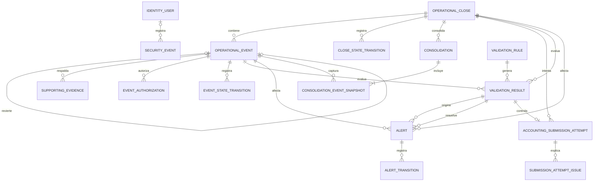

# Modelo de Datos

**Versión:** v0.1

**Estado:** Línea base aprobada

**Fase:** 05 — Diseño técnico

**Producto:** Operational Close Validator

---

## 1. Propósito

Este documento define el modelo relacional del MVP de Operational Close Validator.

Materializa en un esquema verificable:

- los conceptos aprobados en Domain Model v0.3 [modelo de dominio];
- las reglas VR-001, VR-002, VR-003, VR-006 y VR-008;
- las máquinas de estado del Cierre Operativo, Evento Operativo y Alerta;
- la trazabilidad requerida por los casos de uso;
- la estrategia de persistencia, transacciones y concurrencia aprobada en ADR-0004;
- la identidad mínima aprobada en ADR-0005;
- la separación entre Dominio y entidades JPA.

El modelo busca mantener simultáneamente:

- integridad relacional;
- trazabilidad histórica;
- vigencia explícita de validaciones y consolidaciones;
- una sola fuente de datos lógica;
- propiedad lógica por módulo;
- ausencia de acoplamiento entre el Dominio y JPA;
- compatibilidad con PostgreSQL, Flyway y Spring Data JPA;
- consistencia del flujo de VR-008 y envío.

---

## 2. Alcance

### 2.1. Incluye

Este documento decide:

- nombres físicos de tablas y columnas;
- tipos físicos de identificadores;
- tipos monetarios y temporales;
- claves primarias y foráneas;
- restricciones `CHECK`, `UNIQUE` y nulabilidad;
- índices iniciales;
- representación de estados y catálogos;
- persistencia de Resultados de Validación;
- vigencia e invalidación;
- persistencia de Alertas y sus transiciones;
- persistencia de consolidaciones;
- instantánea de eventos utilizada por cada consolidación;
- intentos de envío a contabilidad;
- causas estructuradas de rechazo de VR-008;
- trazabilidad de estados;
- usuario preconfigurado y eventos mínimos de seguridad;
- límites de propiedad de datos por módulo;
- reglas de mapeo entre el modelo relacional y el Dominio;
- orden inicial de migraciones.

### 2.2. No incluye

Este documento no decide:

- almacenamiento físico del contenido binario de Evidencias de Soporte;
- contratos HTTP;
- modelos de formulario o vista;
- clases Java definitivas;
- nombres finales de paquetes;
- proveedor de base de datos;
- versión mayor exacta de PostgreSQL;
- configuración de copias de seguridad;
- retención operativa definitiva;
- estrategia completa de observabilidad;
- proveedor de secretos;
- proveedor de despliegue;
- reapertura de cierres enviados;
- múltiples usuarios, roles o permisos;
- reglas fuera del MVP.

El contenido físico de las Evidencias de Soporte se resolverá mediante un diseño posterior. Este modelo conserva únicamente su referencia abstracta y metadatos.

---

## 3. Fuentes y decisiones heredadas

| Fuente | Restricción heredada |
|---|---|
| Domain Model v0.3 [modelo de dominio] | Entidades, relaciones, estados e invariantes conceptuales |
| Validation Rules v0.2 [reglas de validación] | Catálogo fijo, resultados, severidad y comportamiento de VR-001, VR-002, VR-003, VR-006 y VR-008 |
| State Machine v0.3 [máquina de estados] | Estados y transiciones permitidas |
| Use Cases v0.2 [casos de uso] | Datos mínimos, trazabilidad y postcondiciones |
| Architecture Drivers v0.1 [impulsores de arquitectura] | Persistencia relacional, consistencia, seguridad y trazabilidad |
| ADR-0001 | Una falla de VR-008 rechaza el envío y devuelve el cierre a Bloqueado |
| ADR-0002 | Monolito modular, puertos y adaptadores, una sola unidad desplegable |
| ADR-0003 | Java, Spring Boot, Spring MVC, Thymeleaf y Maven |
| ADR-0004 | PostgreSQL, Spring Data JPA, Hibernate, Flyway, `READ_COMMITTED` y bloqueo por cierre |
| ADR-0005 | Usuario único, form login, sesión HTTP y credenciales externas |
| Architecture Overview v0.1 [visión general de arquitectura] | Responsabilidades, módulos, límite transaccional y propiedad lógica |

---

## 4. Principios de diseño de datos

1. El modelo relacional refuerza las invariantes, pero no sustituye las reglas del Dominio.
2. Las entidades JPA permanecen en Infraestructura.
3. Las entidades del Dominio no contienen anotaciones JPA.
4. Los adaptadores realizan mapeo explícito entre persistencia y Dominio.
5. Flyway es el único mecanismo de creación y evolución del esquema.
6. El contenido de evaluación de un Resultado de Validación es inmutable. Únicamente sus metadatos de vigencia pueden modificarse para registrar su invalidación.
7. Las transiciones de estado son registros históricos inmutables.
8. Los intentos de envío son registros históricos inmutables.
9. El estado actual se conserva junto con su historial explícito.
10. No se utiliza event sourcing.
11. Las entidades operativas no se eliminan físicamente dentro del MVP.
12. Los datos derivados que requieren reconstrucción histórica conservan una instantánea mínima de sus fuentes.
13. Toda mutación relevante de un cierre debe adquirir primero el bloqueo de su fila.
14. Los estados persistidos utilizan códigos estables en inglés; la interfaz presenta etiquetas en español.
15. Los catálogos de reglas y estados no son configurables por el usuario.
16. La sesión HTTP no se persiste en PostgreSQL.
17. El usuario autenticado se registra mediante un identificador estable, no mediante un rol.
18. Los secretos no se incorporan a migraciones ni al repositorio.

---

## 5. Convenciones físicas

### 5.1. Esquema y nombres

Se utiliza el esquema PostgreSQL:

```text
ocv
```

Convenciones:

- tablas en singular y `snake_case`;
- columnas en `snake_case`;
- claves primarias llamadas `id`, salvo catálogos con clave natural;
- claves foráneas terminadas en `_id`;
- fechas y horas terminadas en `_at`;
- fechas de negocio terminadas en `_date`;
- indicadores booleanos con prefijo `is_`, `has_` o sufijo `_required`;
- índices con prefijo `idx_`;
- restricciones únicas con prefijo `uq_`;
- restricciones de comprobación con prefijo `ck_`;
- claves foráneas con prefijo `fk_`.

### 5.2. Identificadores

Las entidades de negocio y trazabilidad utilizan:

```text
uuid
```

Los UUID se generan en la aplicación antes de persistir la entidad.

Justificación:

- permite construir objetos del Dominio antes de acceder a persistencia;
- evita depender de secuencias dentro del Dominio;
- proporciona identificadores estables para relaciones y trazabilidad;
- evita exponer secuencias predecibles en URLs futuras;
- cuenta con soporte nativo en PostgreSQL y Java.

Excepción:

```text
identity_user.user_id = varchar(64)
```

El usuario aprobado utiliza la clave estable:

```text
responsible-user
```

### 5.3. Fechas y horas

Los instantes técnicos utilizan:

```text
timestamp with time zone
```

La aplicación conserva instantes en UTC y aplica zona horaria únicamente al presentar datos.

Los períodos operativos utilizan:

```text
date
```

### 5.4. Importes y efecto sobre el saldo

Los importes monetarios utilizan:

```text
numeric(19,4)
```

La moneda utiliza:

```text
char(3)
```

El código debe cumplir el formato de tres letras mayúsculas.

Cada Cierre Operativo utiliza una sola moneda. Los Eventos Operativos heredan la moneda del cierre y no almacenan un código de moneda independiente.

`amount` conserva siempre el valor nominal positivo del Evento Operativo.

`balance_effect` conserva el efecto firmado y calculado sobre el saldo esperado. No es un valor libre ingresado por el usuario.

Reglas:

```text
INCOME       → balance_effect = +amount
EXPENSE      → balance_effect = -amount
DISCOUNT     → balance_effect = -amount
CANCELLATION → balance_effect = -balance_effect del evento revertido
```

Todo Evento Operativo de tipo `CANCELLATION` debe referenciar mediante `reversed_event_id` un Evento Operativo no cancelatorio del mismo Cierre Operativo.

La Anulación revierte completamente el efecto del evento referenciado:

```text
amount = amount del evento revertido
balance_effect = -balance_effect del evento revertido
```

Un evento distinto de `CANCELLATION` no puede informar `reversed_event_id`.

Las fórmulas de consolidación son:

```text
expected_balance = initial_balance + suma(balance_effect)
difference = actual_balance - expected_balance
```

Los totales por tipo conservan montos nominales positivos. `total_cancellation` no determina por sí solo el signo aplicado al saldo; ese signo se obtiene de `balance_effect`.

### 5.5. Texto

- nombres de usuario: `varchar(100)`;
- nombres de responsables: `varchar(200)`;
- códigos: `varchar(40)` según catálogo;
- referencias externas o de evidencia: `varchar(500)`;
- detalles y justificaciones: `text`;
- hashes de contraseña: `varchar(255)`.

### 5.6. Estados y catálogos

Los estados se persisten mediante `varchar` y restricciones `CHECK`.

No se utilizan tipos `ENUM` nativos de PostgreSQL en el MVP porque:

- cada cambio requeriría una migración específica del tipo;
- `varchar` con `CHECK` mantiene el esquema explícito y portable dentro de PostgreSQL;
- JPA puede mapear los valores como cadenas;
- los catálogos continúan controlados por migraciones.

---

## 6. Propiedad lógica por módulo

### 6.1. Gestión del Cierre Operativo

Es propietario de:

- `operational_close`;
- `operational_event`;
- `supporting_evidence`;
- `event_authorization`;
- `validation_rule`;
- `validation_result`;
- `alert`;
- `alert_transition`;
- `consolidation`;
- `consolidation_event_snapshot`;
- `accounting_submission_attempt`;
- `submission_attempt_issue`;
- `close_state_transition`;
- `event_state_transition`.

### 6.2. Identidad y Acceso

Es propietario de:

- `identity_user`;
- `security_event`.

### 6.3. Referencias de identidad

Las tablas operativas conservan una copia inmutable de:

```text
actor_user_id
actor_username
```

No se define una clave foránea desde el módulo operativo hacia `identity_user`.

Esta decisión:

- evita acceso directo del módulo operativo a estructuras internas de Identidad y Acceso;
- conserva legibilidad histórica aunque el nombre de inicio de sesión cambie;
- mantiene la identidad estable `responsible-user`;
- permite atribuir acciones sin introducir roles ni permisos.

El límite de Aplicación valida que `AuthenticatedPrincipal.userId` corresponda al usuario responsable antes de ejecutar una operación protegida.

---

## 7. Vista general del modelo



Las relaciones polimórficas de `validation_result` y `alert` se implementan mediante dos claves foráneas opcionales y una restricción que exige exactamente una entidad afectada.

La autorrelación de `operational_event` es condicional:

- un Evento Operativo no cancelatorio puede ser revertido por cero o una Anulación;
- una Anulación referencia exactamente un evento no cancelatorio;
- ambos eventos pertenecen al mismo Cierre Operativo.

`security_event.user_id` es opcional porque un intento fallido puede ocurrir antes de identificar un usuario válido.

---

## 8. Catálogos físicos

### 8.1. Estado del Cierre Operativo

| Código persistido | Etiqueta |
|---|---|
| `PREPARATION` | Preparación |
| `BLOCKED` | Bloqueado |
| `VALIDATED` | Validado |
| `SENT_TO_ACCOUNTING` | Enviado a contabilidad |

`PROVISIONAL` no forma parte del esquema del MVP.

### 8.2. Tipo de Evento Operativo

| Código persistido | Etiqueta |
|---|---|
| `INCOME` | Ingreso |
| `EXPENSE` | Egreso |
| `DISCOUNT` | Descuento |
| `CANCELLATION` | Anulación |

### 8.3. Estado del Evento Operativo

| Código persistido | Etiqueta |
|---|---|
| `REGISTERED` | Registrado |
| `PENDING_SUPPORT` | Pendiente de soporte |
| `PENDING_AUTHORIZATION` | Pendiente de autorización |
| `OBSERVED` | Con observaciones |
| `VALIDATED` | Validado |

`PENDING_EXTERNAL_RECONCILIATION` no forma parte del esquema del MVP.

### 8.4. Estado de la Alerta

| Código persistido | Etiqueta |
|---|---|
| `ACTIVE` | Activa |
| `ACKNOWLEDGED` | Reconocida |
| `UNDER_REVIEW` | En revisión |
| `RESOLVED` | Resuelta |
| `DISCARDED` | Descartada |

### 8.5. Resultado de validación

| Código persistido | Etiqueta |
|---|---|
| `SATISFIED` | Satisfecha |
| `FAILED` | Fallida |

`PENDING` no se utiliza en el MVP.

### 8.6. Severidad

| Código persistido | Etiqueta |
|---|---|
| `CRITICAL` | Crítica |
| `HIGH` | Alta |

### 8.7. Estado de legibilidad

| Código persistido | Significado |
|---|---|
| `UNVERIFIED` | Aún no fue verificada |
| `LEGIBLE` | Se considera legible |
| `ILLEGIBLE` | No satisface legibilidad |

### 8.8. Resultado del intento de envío

| Código persistido | Significado |
|---|---|
| `SUCCEEDED` | VR-008 fue satisfecha y el cierre fue enviado |
| `REJECTED` | VR-008 falló y el cierre quedó Bloqueado |

---

## 9. Tabla `identity_user`

### 9.1. Propósito

Conservar el único usuario preconfigurado y la versión de su credencial.

### 9.2. Columnas

| Columna | Tipo | Nulo | Descripción |
|---|---|---:|---|
| `user_id` | `varchar(64)` | No | Identificador estable; valor permitido `responsible-user` |
| `username` | `varchar(100)` | No | Nombre visible y configurable de inicio de sesión |
| `username_normalized` | `varchar(100)` | No | Versión normalizada para comparación |
| `password_hash` | `varchar(255)` | No | Hash completo con prefijo de `DelegatingPasswordEncoder` |
| `is_enabled` | `boolean` | No | Estado habilitado |
| `credential_version` | `bigint` | No | Incrementa cuando cambia el hash |
| `provisioned_at` | `timestamptz` | No | Aprovisionamiento inicial |
| `updated_at` | `timestamptz` | No | Última sincronización |

### 9.3. Restricciones

- clave primaria: `user_id`;
- `user_id = 'responsible-user'`;
- `username_normalized` único;
- `credential_version >= 1`;
- `password_hash` no puede ser vacío;
- la tabla puede contener como máximo un registro;
- las migraciones no insertan un hash real;
- el aprovisionamiento se ejecuta al iniciar la aplicación conforme a ADR-0005.

### 9.4. Índices

- `uq_identity_user_username_normalized`.

---

## 10. Tabla `security_event`

### 10.1. Propósito

Conservar eventos mínimos de autenticación sin registrar secretos.

### 10.2. Columnas

| Columna | Tipo | Nulo | Descripción |
|---|---|---:|---|
| `id` | `uuid` | No | Identificador |
| `user_id` | `varchar(64)` | Sí | Usuario conocido cuando corresponda |
| `username_normalized` | `varchar(100)` | Sí | Nombre presentado, sanitizado |
| `event_type` | `varchar(40)` | No | Tipo de evento |
| `occurred_at` | `timestamptz` | No | Momento |
| `source_address` | `inet` | Sí | Dirección obtenida de fuente confiable |
| `detail` | `varchar(500)` | Sí | Detalle sanitizado |

Tipos permitidos:

- `USER_PROVISIONED`;
- `CREDENTIAL_ROTATED`;
- `LOGIN_SUCCEEDED`;
- `LOGIN_FAILED`;
- `LOGIN_RATE_LIMITED`;
- `SESSION_REPLACED`;
- `LOGOUT`;
- `SESSION_EXPIRED`;
- `CONFIGURATION_FAILED`.

### 10.3. Restricciones

- clave primaria: `id`;
- no se persisten contraseña, hash completo, cookie, token CSRF ni identificador completo de sesión;
- `user_id`, cuando existe, debe ser `responsible-user`;
- los registros son append-only.

### 10.4. Índices

- `idx_security_event_occurred_at`;
- `idx_security_event_user_occurred_at`;
- `idx_security_event_type_occurred_at`.

---

## 11. Tabla `operational_close`

### 11.1. Propósito

Representar el agregado operativo que agrupa eventos, controla su estado y actúa como puerta de concurrencia.

### 11.2. Columnas

| Columna | Tipo | Nulo | Descripción |
|---|---|---:|---|
| `id` | `uuid` | No | Identificador del cierre |
| `period_start` | `date` | No | Inicio del período |
| `period_end` | `date` | No | Fin del período |
| `currency_code` | `char(3)` | No | Moneda del cierre |
| `initial_balance` | `numeric(19,4)` | No | Saldo inicial |
| `state` | `varchar(30)` | No | Estado actual |
| `state_changed_at` | `timestamptz` | No | Última transición |
| `created_at` | `timestamptz` | No | Creación |
| `created_by_user_id` | `varchar(64)` | No | Actor estable |
| `created_by_username` | `varchar(100)` | No | Nombre visible al crear |
| `updated_at` | `timestamptz` | No | Última modificación |
| `updated_by_user_id` | `varchar(64)` | No | Actor de última modificación |
| `updated_by_username` | `varchar(100)` | No | Nombre visible |

### 11.3. Restricciones

- clave primaria: `id`;
- `period_end >= period_start`;
- `currency_code` debe cumplir `[A-Z]{3}`;
- `initial_balance >= 0`;
- estado permitido del MVP;
- único período `period_start + period_end`;
- actores iguales a `responsible-user`;
- un cierre en `SENT_TO_ACCOUNTING` no admite mutaciones posteriores;
- la fila se bloquea antes de toda escritura relevante.

### 11.4. Índices

- `uq_operational_close_period`;
- `idx_operational_close_state`;
- `idx_operational_close_period_end`.

### 11.5. Datos derivados no duplicados

No se almacenan en esta tabla:

- totales por tipo;
- saldo esperado;
- saldo real;
- diferencia;
- fecha de consolidación;
- fecha de envío.

Esos datos se obtienen de la consolidación vigente y del intento de envío exitoso.

---

## 12. Tabla `close_state_transition`

### 12.1. Propósito

Conservar el historial de estados del Cierre Operativo.

### 12.2. Columnas

| Columna | Tipo | Nulo | Descripción |
|---|---|---:|---|
| `id` | `uuid` | No | Identificador |
| `close_id` | `uuid` | No | Cierre |
| `from_state` | `varchar(30)` | Sí | Estado anterior; nulo en creación |
| `to_state` | `varchar(30)` | No | Estado posterior |
| `cause_code` | `varchar(40)` | No | Motivo estructurado |
| `detail` | `text` | Sí | Explicación |
| `validation_result_id` | `uuid` | Sí | Resultado relacionado |
| `consolidation_id` | `uuid` | Sí | Consolidación relacionada |
| `submission_attempt_id` | `uuid` | Sí | Intento relacionado |
| `occurred_at` | `timestamptz` | No | Momento |
| `actor_user_id` | `varchar(64)` | No | Actor |
| `actor_username` | `varchar(100)` | No | Nombre visible |

### 12.3. Restricciones

- clave primaria: `id`;
- clave foránea a `operational_close`;
- estados permitidos del MVP;
- `from_state <> to_state` cuando `from_state` no es nulo;
- registros append-only;
- no se permite una transición desde `SENT_TO_ACCOUNTING` dentro del MVP;
- la transición actual debe coincidir con `operational_close.state`.

### 12.4. Índices

- `idx_close_transition_close_occurred_at`;
- `idx_close_transition_to_state`.

---

## 13. Tabla `operational_event`

### 13.1. Propósito

Representar un movimiento registrado dentro de un cierre.

### 13.2. Columnas

| Columna | Tipo | Nulo | Descripción |
|---|---|---:|---|
| `id` | `uuid` | No | Identificador |
| `close_id` | `uuid` | No | Cierre propietario |
| `event_type` | `varchar(20)` | No | Tipo |
| `amount` | `numeric(19,4)` | No | Monto nominal positivo |
| `balance_effect` | `numeric(19,4)` | No | Efecto firmado calculado sobre el saldo esperado |
| `reversed_event_id` | `uuid` | Sí | Evento revertido por una Anulación |
| `occurred_at` | `timestamptz` | No | Ocurrencia |
| `registered_at` | `timestamptz` | No | Registro en el sistema |
| `responsible_name` | `varchar(200)` | No | Responsable de negocio informado |
| `description` | `text` | No | Motivo o descripción |
| `state` | `varchar(30)` | No | Estado actual |
| `evidence_required` | `boolean` | No | Indicador calculado |
| `authorization_required` | `boolean` | No | Indicador calculado |
| `data_revision` | `bigint` | No | Revisión de datos relevantes |
| `state_changed_at` | `timestamptz` | No | Última transición |
| `created_at` | `timestamptz` | No | Creación |
| `created_by_user_id` | `varchar(64)` | No | Usuario de registro |
| `created_by_username` | `varchar(100)` | No | Nombre visible |
| `updated_at` | `timestamptz` | No | Última modificación |
| `updated_by_user_id` | `varchar(64)` | No | Usuario de modificación |
| `updated_by_username` | `varchar(100)` | No | Nombre visible |

### 13.3. Restricciones estructurales

- clave primaria: `id`;
- clave foránea a `operational_close`;
- clave foránea opcional de `reversed_event_id` a `operational_event`;
- `amount > 0`;
- `abs(balance_effect) = amount`;
- tipo y estado permitidos;
- `data_revision >= 1`;
- actor estable `responsible-user`;
- `reversed_event_id` es obligatorio cuando `event_type = CANCELLATION`;
- `reversed_event_id` es nulo cuando `event_type <> CANCELLATION`;
- un mismo evento solo puede ser objetivo de una Anulación;
- no se puede crear ni modificar cuando el cierre está Enviado;
- todo cambio relevante incrementa `data_revision`;
- un evento pertenece exactamente a un cierre;
- no existe eliminación física en el MVP.

### 13.4. Reglas semánticas de `balance_effect`

Aplicación y Dominio garantizan:

```text
INCOME       → balance_effect = amount
EXPENSE      → balance_effect = -amount
DISCOUNT     → balance_effect = -amount
CANCELLATION → balance_effect = -balance_effect del evento revertido
```

Para una Anulación:

- `reversed_event_id` no puede referenciar al mismo evento;
- el evento revertido pertenece al mismo cierre;
- el evento revertido no es otra Anulación;
- `amount` coincide con el monto del evento revertido;
- la referencia ya existía al registrar la Anulación;
- VR-006 continúa exigiendo autorización formal.

La modificación de un evento ya referenciado por una Anulación obliga a recalcular la Anulación, incrementar su revisión e invalidar los Resultados de Validación y consolidaciones dependientes.

### 13.5. Cambios que incrementan `data_revision`

- tipo;
- monto;
- efecto sobre el saldo;
- evento revertido;
- fecha y hora de ocurrencia;
- responsable;
- descripción;
- indicador de evidencia;
- indicador de autorización;
- incorporación, sustitución o retiro de evidencia;
- incorporación, sustitución o retiro de autorización.

El incremento de revisión apoya trazabilidad e instantáneas; no reemplaza el bloqueo pesimista del cierre.

### 13.6. Índices

- `idx_operational_event_close_state`;
- `idx_operational_event_close_type`;
- `idx_operational_event_close_occurred_at`;
- `uq_operational_event_reversed_event`, parcial y único por `reversed_event_id` cuando `event_type = 'CANCELLATION'`.

---

## 14. Tabla `event_state_transition`

### 14.1. Propósito

Conservar el historial de estados de un Evento Operativo.

### 14.2. Columnas

| Columna | Tipo | Nulo | Descripción |
|---|---|---:|---|
| `id` | `uuid` | No | Identificador |
| `event_id` | `uuid` | No | Evento |
| `from_state` | `varchar(30)` | Sí | Estado anterior |
| `to_state` | `varchar(30)` | No | Estado posterior |
| `cause_code` | `varchar(40)` | No | Regla o causa |
| `detail` | `text` | Sí | Explicación |
| `validation_result_id` | `uuid` | Sí | Resultado relacionado |
| `occurred_at` | `timestamptz` | No | Momento |
| `actor_user_id` | `varchar(64)` | No | Actor |
| `actor_username` | `varchar(100)` | No | Nombre visible |

### 14.3. Restricciones

- clave primaria: `id`;
- clave foránea a `operational_event`;
- estados permitidos del MVP;
- `from_state <> to_state` cuando aplica;
- registros append-only;
- el estado actual debe coincidir con `operational_event.state`.

### 14.4. Índices

- `idx_event_transition_event_occurred_at`;
- `idx_event_transition_to_state`.

---

## 15. Tabla `supporting_evidence`

### 15.1. Propósito

Conservar los metadatos y la referencia abstracta de una Evidencia de Soporte.

### 15.2. Columnas

| Columna | Tipo | Nulo | Descripción |
|---|---|---:|---|
| `id` | `uuid` | No | Identificador |
| `event_id` | `uuid` | No | Evento respaldado |
| `evidence_type` | `varchar(40)` | No | Tipo de evidencia |
| `content_reference` | `varchar(500)` | No | Referencia abstracta |
| `supported_amount` | `numeric(19,4)` | Sí | Monto respaldado |
| `evidence_date` | `date` | No | Fecha del documento |
| `legibility_status` | `varchar(20)` | No | Estado de legibilidad |
| `is_active` | `boolean` | No | Participa en validaciones actuales |
| `revision` | `bigint` | No | Revisión |
| `created_at` | `timestamptz` | No | Creación |
| `created_by_user_id` | `varchar(64)` | No | Actor |
| `created_by_username` | `varchar(100)` | No | Nombre visible |
| `updated_at` | `timestamptz` | No | Modificación |
| `updated_by_user_id` | `varchar(64)` | No | Actor |
| `updated_by_username` | `varchar(100)` | No | Nombre visible |
| `deactivated_at` | `timestamptz` | Sí | Sustitución o retiro |

### 15.3. Restricciones

- clave primaria: `id`;
- clave foránea a `operational_event`;
- `supported_amount > 0` cuando existe;
- estado de legibilidad permitido;
- `revision >= 1`;
- `content_reference` no puede ser vacía;
- `is_active = true` exige `deactivated_at` nulo;
- `is_active = false` exige `deactivated_at` no nulo;
- una modificación relevante invalida Resultados dependientes;
- el contenido físico no se almacena en esta tabla.

### 15.4. Índices

- `idx_supporting_evidence_event_active`;
- `idx_supporting_evidence_event_date`.

---

## 16. Tabla `event_authorization`

### 16.1. Propósito

Conservar una Autorización formal vinculada a un Evento Operativo.

### 16.2. Columnas

| Columna | Tipo | Nulo | Descripción |
|---|---|---:|---|
| `id` | `uuid` | No | Identificador |
| `event_id` | `uuid` | No | Evento autorizado |
| `authorized_by_name` | `varchar(200)` | No | Persona que autorizó |
| `reason` | `text` | No | Motivo |
| `authorized_at` | `timestamptz` | No | Fecha y hora |
| `formal_reference` | `varchar(500)` | No | Referencia verificable |
| `is_active` | `boolean` | No | Participa en validación actual |
| `revision` | `bigint` | No | Revisión |
| `created_at` | `timestamptz` | No | Creación |
| `created_by_user_id` | `varchar(64)` | No | Usuario que registró |
| `created_by_username` | `varchar(100)` | No | Nombre visible |
| `updated_at` | `timestamptz` | No | Modificación |
| `updated_by_user_id` | `varchar(64)` | No | Usuario que modificó |
| `updated_by_username` | `varchar(100)` | No | Nombre visible |
| `deactivated_at` | `timestamptz` | Sí | Sustitución o retiro |

### 16.3. Restricciones

- clave primaria: `id`;
- clave foránea a `operational_event`;
- `formal_reference` no puede ser vacía;
- `reason` no puede ser vacía;
- `revision >= 1`;
- `is_active = true` exige `deactivated_at` nulo;
- `is_active = false` exige `deactivated_at` no nulo;
- una modificación relevante invalida Resultados dependientes.

### 16.4. Índices

- `idx_event_authorization_event_active`;
- `idx_event_authorization_authorized_at`.

---

## 17. Tabla `validation_rule`

### 17.1. Propósito

Conservar el catálogo interno, fijo y versionado de reglas del MVP.

### 17.2. Clave

La clave primaria es compuesta:

```text
rule_code
rule_version
```

### 17.3. Columnas

| Columna | Tipo | Nulo | Descripción |
|---|---|---:|---|
| `rule_code` | `varchar(10)` | No | Código VR |
| `rule_version` | `integer` | No | Versión de la definición |
| `name` | `varchar(200)` | No | Nombre |
| `description` | `text` | No | Condición |
| `scope` | `varchar(10)` | No | `EVENT` o `CLOSE` |
| `severity` | `varchar(10)` | No | Severidad |
| `failure_effect` | `varchar(40)` | No | Efecto |
| `is_current` | `boolean` | No | Versión activa del catálogo |
| `created_at` | `timestamptz` | No | Alta por migración |

### 17.4. Datos iniciales

| Código | Alcance | Severidad |
|---|---|---|
| `VR-001` | `EVENT` | `CRITICAL` |
| `VR-002` | `EVENT` | `CRITICAL` |
| `VR-003` | `EVENT` | `HIGH` |
| `VR-006` | `EVENT` | `CRITICAL` |
| `VR-008` | `CLOSE` | `CRITICAL` |

### 17.5. Restricciones

- clave primaria compuesta;
- `rule_version >= 1`;
- una sola versión actual por `rule_code`;
- solo migraciones pueden insertar o cambiar catálogo;
- la aplicación no expone operaciones de creación, edición, activación o desactivación.

### 17.6. Índices

- `uq_validation_rule_current` parcial por `rule_code` cuando `is_current = true`;
- `idx_validation_rule_scope_current`.

---

## 18. Tabla `validation_result`

### 18.1. Propósito

Conservar cada evaluación de una regla sobre un Evento Operativo o Cierre Operativo.

El contenido de la evaluación es inmutable. Únicamente los metadatos de vigencia pueden cambiar para registrar una invalidación posterior.

### 18.2. Columnas

| Columna | Tipo | Nulo | Descripción |
|---|---|---:|---|
| `id` | `uuid` | No | Identificador |
| `rule_code` | `varchar(10)` | No | Regla |
| `rule_version` | `integer` | No | Versión exacta |
| `event_id` | `uuid` | Sí | Evento evaluado |
| `close_id` | `uuid` | Sí | Cierre evaluado |
| `outcome` | `varchar(15)` | No | `SATISFIED` o `FAILED` |
| `detail` | `text` | No | Explicación |
| `evaluated_at` | `timestamptz` | No | Momento |
| `evaluated_by_user_id` | `varchar(64)` | No | Actor |
| `evaluated_by_username` | `varchar(100)` | No | Nombre visible |
| `event_data_revision` | `bigint` | Sí | Revisión del evento evaluado |
| `consolidation_id` | `uuid` | Sí | Consolidación evaluada, cuando existe |
| `is_current` | `boolean` | No | Vigencia |
| `invalidated_at` | `timestamptz` | Sí | Momento de invalidación |
| `invalidation_reason` | `text` | Sí | Causa |

### 18.3. Restricciones estructurales

- clave primaria: `id`;
- clave foránea compuesta a `validation_rule`;
- claves foráneas opcionales a Evento Operativo, Cierre Operativo y consolidación;
- exactamente uno entre `event_id` y `close_id` debe ser no nulo;
- `event_data_revision` es obligatorio cuando se evalúa un evento;
- `event_data_revision` es nulo cuando se evalúa un cierre;
- `consolidation_id` es obligatorio cuando VR-008 queda `SATISFIED`;
- `consolidation_id` puede ser nulo cuando VR-008 queda `FAILED` por consolidación ausente;
- `is_current = true` exige `invalidated_at` e `invalidation_reason` nulos;
- `is_current = false` exige `invalidated_at` e `invalidation_reason` no nulos;
- solo puede existir un resultado vigente por regla y entidad;
- `PENDING` no está permitido en el MVP.

### 18.4. Reglas semánticas

Aplicación y Dominio garantizan:

- una regla con alcance `EVENT` solo evalúa Eventos Operativos;
- una regla con alcance `CLOSE` solo evalúa Cierres Operativos;
- cuando `consolidation_id` existe, pertenece al mismo cierre evaluado;
- una VR-008 Satisfecha referencia una consolidación vigente;
- una VR-008 Fallida por `CONSOLIDATION_MISSING` no referencia consolidación;
- el resultado conserva la versión exacta de la regla aplicada;
- un resultado de evento conserva la revisión exacta evaluada.

### 18.5. Índices

- `uq_validation_result_current_event_rule`, parcial por `event_id + rule_code` cuando `is_current = true`;
- `uq_validation_result_current_close_rule`, parcial por `close_id + rule_code` cuando `is_current = true`;
- `idx_validation_result_event_current`;
- `idx_validation_result_close_current`;
- `idx_validation_result_rule_outcome`;
- `idx_validation_result_evaluated_at`.

### 18.6. Regla de inmutabilidad

Después de crear un resultado solo pueden cambiar:

- `is_current`;
- `invalidated_at`;
- `invalidation_reason`.

No se modifica retroactivamente:

- regla;
- entidad evaluada;
- resultado;
- detalle;
- fecha;
- actor;
- revisión de datos;
- consolidación evaluada.

---

## 19. Tabla `alert`

### 19.1. Propósito

Representar la inconsistencia visible y su estado actual.

### 19.2. Columnas

| Columna | Tipo | Nulo | Descripción |
|---|---|---:|---|
| `id` | `uuid` | No | Identificador |
| `event_id` | `uuid` | Sí | Evento afectado |
| `close_id` | `uuid` | Sí | Cierre afectado |
| `source_validation_result_id` | `uuid` | Sí | Resultado que originó la Alerta |
| `cause_code` | `varchar(40)` | No | Regla o condición |
| `severity` | `varchar(10)` | No | Severidad |
| `is_blocking` | `boolean` | No | Efecto bloqueante |
| `state` | `varchar(20)` | No | Estado actual |
| `detail` | `text` | No | Descripción |
| `resolved_by_validation_result_id` | `uuid` | Sí | Revalidación que autorizó la resolución |
| `discard_justification` | `text` | Sí | Justificación |
| `created_at` | `timestamptz` | No | Creación |
| `created_by_user_id` | `varchar(64)` | No | Actor |
| `created_by_username` | `varchar(100)` | No | Nombre visible |
| `updated_at` | `timestamptz` | No | Última gestión |
| `closed_at` | `timestamptz` | Sí | Cierre terminal |

### 19.3. Restricciones

- clave primaria: `id`;
- exactamente uno entre `event_id` y `close_id` debe ser no nulo;
- estados y severidades permitidos;
- si `state = RESOLVED`, `resolved_by_validation_result_id` y `closed_at` son obligatorios;
- si `state = DISCARDED`, `discard_justification` no vacía y `closed_at` son obligatorios;
- si la Alerta no es terminal, `closed_at` debe ser nulo;
- al transicionar a `RESOLVED`, el resultado asociado debe estar vigente, Satisfecho y evaluar la misma entidad;
- una invalidación posterior del resultado no reescribe la resolución histórica de la Alerta;
- una Alerta Descartada no valida automáticamente la entidad;
- una Alerta terminal no se reabre; una nueva inconsistencia genera una nueva Alerta;
- no se elimina físicamente.

La comprobación de que el resultado de resolución era `SATISFIED`, vigente y compatible con la entidad en el momento de la transición se ejecuta en el Dominio y se verifica mediante prueba de integración.

### 19.4. Índices

- `idx_alert_event_state`;
- `idx_alert_close_state`;
- `idx_alert_blocking_open_event`, parcial para alertas bloqueantes no terminales;
- `idx_alert_blocking_open_close`, parcial para alertas bloqueantes no terminales;
- `idx_alert_source_validation_result`.

---

## 20. Tabla `alert_transition`

### 20.1. Propósito

Conservar cada transición o acción relevante sobre una Alerta.

### 20.2. Columnas

| Columna | Tipo | Nulo | Descripción |
|---|---|---:|---|
| `id` | `uuid` | No | Identificador |
| `alert_id` | `uuid` | No | Alerta |
| `from_state` | `varchar(20)` | Sí | Estado anterior |
| `to_state` | `varchar(20)` | No | Estado posterior |
| `action_code` | `varchar(40)` | No | Acción |
| `detail` | `text` | Sí | Explicación |
| `justification` | `text` | Sí | Obligatoria para descarte |
| `validation_result_id` | `uuid` | Sí | Obligatorio para resolución |
| `occurred_at` | `timestamptz` | No | Momento |
| `actor_user_id` | `varchar(64)` | No | Actor |
| `actor_username` | `varchar(100)` | No | Nombre visible |

### 20.3. Restricciones

- clave primaria: `id`;
- clave foránea a `alert`;
- estados permitidos;
- `from_state <> to_state` cuando aplica;
- una transición a `RESOLVED` exige `validation_result_id`;
- una transición a `DISCARDED` exige justificación;
- registros append-only.

### 20.4. Índices

- `idx_alert_transition_alert_occurred_at`;
- `idx_alert_transition_to_state`.

---

## 21. Tabla `consolidation`

### 21.1. Propósito

Conservar una consolidación histórica del cierre y su vigencia.

### 21.2. Columnas

| Columna | Tipo | Nulo | Descripción |
|---|---|---:|---|
| `id` | `uuid` | No | Identificador |
| `close_id` | `uuid` | No | Cierre |
| `currency_code` | `char(3)` | No | Moneda |
| `event_count` | `integer` | No | Eventos incluidos |
| `total_income` | `numeric(19,4)` | No | Total nominal de Ingresos |
| `total_expense` | `numeric(19,4)` | No | Total nominal de Egresos |
| `total_discount` | `numeric(19,4)` | No | Total nominal de Descuentos |
| `total_cancellation` | `numeric(19,4)` | No | Total nominal de Anulaciones |
| `initial_balance` | `numeric(19,4)` | No | Saldo inicial utilizado |
| `expected_balance` | `numeric(19,4)` | No | Saldo esperado calculado |
| `actual_balance` | `numeric(19,4)` | No | Saldo real informado |
| `difference` | `numeric(19,4)` | No | Diferencia calculada |
| `is_current` | `boolean` | No | Vigencia |
| `completed_at` | `timestamptz` | No | Consolidación |
| `completed_by_user_id` | `varchar(64)` | No | Actor |
| `completed_by_username` | `varchar(100)` | No | Nombre visible |
| `invalidated_at` | `timestamptz` | Sí | Invalidación |
| `invalidation_reason` | `text` | Sí | Causa |

### 21.3. Restricciones estructurales

- clave primaria: `id`;
- clave foránea a `operational_close`;
- `event_count >= 1`;
- `total_income`, `total_expense`, `total_discount` y `total_cancellation` son no negativos;
- `initial_balance >= 0`;
- `actual_balance >= 0`;
- `expected_balance` y `difference` pueden ser negativos;
- `currency_code` coincide con la moneda del cierre;
- solo puede existir una consolidación vigente por cierre;
- `is_current = true` exige `invalidated_at` e `invalidation_reason` nulos;
- `is_current = false` exige `invalidated_at` e `invalidation_reason` no nulos;
- registros históricos no se eliminan;
- el cierre solo puede quedar `VALIDATED` con una consolidación vigente.

### 21.4. Fórmulas y consistencia

Los totales por tipo se calculan con el monto nominal:

```text
total_income       = suma(amount donde event_type = INCOME)
total_expense      = suma(amount donde event_type = EXPENSE)
total_discount     = suma(amount donde event_type = DISCOUNT)
total_cancellation = suma(amount donde event_type = CANCELLATION)
```

El saldo se calcula con el efecto firmado:

```text
expected_balance = initial_balance + suma(balance_effect)
difference = actual_balance - expected_balance
```

Las fórmulas utilizan exclusivamente las filas de `consolidation_event_snapshot`.

Aplicación garantiza, dentro de la transacción:

- que todos y solo los Eventos Operativos vigentes del cierre estén incluidos;
- que todos los eventos estén Validados;
- que `event_count` coincida con la cantidad de snapshots;
- que los totales y saldos coincidan con los snapshots;
- que no existan Alertas bloqueantes activas;
- que todos los Resultados aplicables estén vigentes y satisfechos.

Una falla de VR-008 invalida la consolidación evaluada, cuando existe, porque el cierre requiere una nueva consolidación antes de volver a Validado.

### 21.5. Índices

- `uq_consolidation_current_close`, parcial por `close_id` cuando `is_current = true`;
- `idx_consolidation_close_completed_at`.

---

## 22. Tabla `consolidation_event_snapshot`

### 22.1. Propósito

Conservar qué versión de cada Evento Operativo fue utilizada por una consolidación.

Esta tabla permite reconstruir la base de cálculo sin depender del estado actual del evento.

### 22.2. Clave

Clave primaria compuesta:

```text
consolidation_id
event_id
```

### 22.3. Columnas

| Columna | Tipo | Nulo | Descripción |
|---|---|---:|---|
| `consolidation_id` | `uuid` | No | Consolidación |
| `event_id` | `uuid` | No | Evento incluido |
| `event_data_revision` | `bigint` | No | Revisión utilizada |
| `event_type` | `varchar(20)` | No | Tipo capturado |
| `amount` | `numeric(19,4)` | No | Monto nominal capturado |
| `balance_effect` | `numeric(19,4)` | No | Efecto firmado capturado |
| `reversed_event_id` | `uuid` | Sí | Evento revertido capturado |
| `event_state` | `varchar(30)` | No | Debe ser `VALIDATED` |
| `captured_at` | `timestamptz` | No | Momento de captura |

### 22.4. Restricciones estructurales

- claves foráneas a consolidación y evento;
- clave foránea opcional de `reversed_event_id` a Evento Operativo;
- `event_data_revision >= 1`;
- `amount > 0`;
- `abs(balance_effect) = amount`;
- `event_state = VALIDATED`;
- `reversed_event_id` es obligatorio para `CANCELLATION`;
- `reversed_event_id` es nulo para los demás tipos;
- las filas son append-only.

### 22.5. Reglas semánticas

Aplicación garantiza:

- que todos los eventos pertenecen al mismo cierre de la consolidación;
- que la revisión capturada coincide con la revisión evaluada;
- que el efecto firmado respeta el tipo del evento;
- que una Anulación conserva la referencia y el efecto del evento revertido;
- que la cantidad de filas coincide con `consolidation.event_count`;
- que los totales nominales coinciden con las filas capturadas;
- que `expected_balance` y `difference` cumplen las fórmulas aprobadas.

Las comprobaciones que atraviesan varias tablas se ejecutan en el caso de uso transaccional y se prueban contra PostgreSQL.

### 22.6. Índices

- clave primaria compuesta;
- `idx_consolidation_snapshot_event`;
- `idx_consolidation_snapshot_reversed_event`.

---

## 23. Tabla `accounting_submission_attempt`

### 23.1. Propósito

Conservar cada intento de envío y su resultado de negocio.

Un intento rechazado se confirma junto con:

- VR-008 Fallida;
- transición del cierre a Bloqueado;
- causas;
- trazabilidad;
- invalidación de la consolidación evaluada, cuando existe.

Un intento exitoso se confirma junto con:

- VR-008 Satisfecha;
- registro interno del envío;
- transición terminal.

### 23.2. Columnas

| Columna | Tipo | Nulo | Descripción |
|---|---|---:|---|
| `id` | `uuid` | No | Identificador |
| `close_id` | `uuid` | No | Cierre |
| `vr008_result_id` | `uuid` | No | Resultado de VR-008 |
| `consolidation_id` | `uuid` | Sí | Consolidación evaluada, cuando existe |
| `outcome` | `varchar(15)` | No | Resultado |
| `attempted_at` | `timestamptz` | No | Momento |
| `attempted_by_user_id` | `varchar(64)` | No | Actor |
| `attempted_by_username` | `varchar(100)` | No | Nombre visible |
| `summary` | `text` | Sí | Resumen sanitizado |

### 23.3. Restricciones estructurales

- clave primaria: `id`;
- claves foráneas a cierre y Resultado de Validación;
- clave foránea opcional a consolidación;
- `vr008_result_id` único;
- resultado permitido `SUCCEEDED` o `REJECTED`;
- `consolidation_id` es obligatorio cuando `outcome = SUCCEEDED`;
- `consolidation_id` puede ser nulo cuando `outcome = REJECTED`;
- solo puede existir un intento `SUCCEEDED` por cierre;
- registros append-only.

### 23.4. Reglas semánticas

Aplicación garantiza:

- que el resultado referenciado corresponde a `VR-008` y al mismo cierre;
- que `SUCCEEDED` exige Resultado `SATISFIED`;
- que `REJECTED` exige Resultado `FAILED`;
- que una consolidación referenciada pertenece al mismo cierre;
- que el intento exitoso referencia la misma consolidación que VR-008;
- que un intento exitoso produce la transición a `SENT_TO_ACCOUNTING`;
- que un intento rechazado produce o conserva la transición a `BLOCKED`;
- que un rechazo contiene al menos una causa estructurada;
- que un rechazo sin consolidación registra `CONSOLIDATION_MISSING`;
- que un rechazo con consolidación invalida esa consolidación.

Las relaciones semánticas entre resultado, cierre y consolidación se validan en el caso de uso y mediante pruebas de integración.

### 23.5. Índices

- `uq_submission_success_close`, parcial por `close_id` cuando `outcome = 'SUCCEEDED'`;
- `uq_submission_vr008_result`;
- `idx_submission_close_attempted_at`;
- `idx_submission_outcome_attempted_at`.

---

## 24. Tabla `submission_attempt_issue`

### 24.1. Propósito

Conservar las causas y entidades afectadas que explican un rechazo de VR-008.

### 24.2. Columnas

| Columna | Tipo | Nulo | Descripción |
|---|---|---:|---|
| `id` | `uuid` | No | Identificador |
| `submission_attempt_id` | `uuid` | No | Intento rechazado |
| `issue_type` | `varchar(40)` | No | Tipo de condición |
| `event_id` | `uuid` | Sí | Evento afectado |
| `alert_id` | `uuid` | Sí | Alerta afectada |
| `validation_result_id` | `uuid` | Sí | Resultado afectado |
| `consolidation_id` | `uuid` | Sí | Consolidación afectada |
| `detail` | `text` | No | Explicación no vacía |

Tipos iniciales:

- `EVENT_NOT_VALIDATED`;
- `BLOCKING_ALERT`;
- `VALIDATION_RESULT_FAILED`;
- `VALIDATION_RESULT_STALE`;
- `CONSOLIDATION_MISSING`;
- `CONSOLIDATION_STALE`;
- `OTHER_CRITICAL_INCONSISTENCY`.

### 24.3. Restricciones estructurales

- clave primaria: `id`;
- clave foránea al intento;
- claves foráneas opcionales a Evento, Alerta, Resultado y consolidación;
- `issue_type` pertenece al catálogo aprobado;
- `detail` no puede estar vacío;
- registros append-only.

### 24.4. Reglas semánticas

Aplicación garantiza:

- que el intento relacionado es `REJECTED`;
- que las entidades referenciadas pertenecen al mismo cierre;
- `EVENT_NOT_VALIDATED` referencia `event_id`;
- `BLOCKING_ALERT` referencia `alert_id`;
- `VALIDATION_RESULT_FAILED` y `VALIDATION_RESULT_STALE` referencian `validation_result_id`;
- `CONSOLIDATION_STALE` referencia `consolidation_id`;
- `CONSOLIDATION_MISSING` no referencia una consolidación inexistente;
- `OTHER_CRITICAL_INCONSISTENCY` conserva detalle suficiente aunque no exista una referencia específica;
- todo intento rechazado contiene al menos una fila.

### 24.5. Índices

- `idx_submission_issue_attempt`;
- `idx_submission_issue_event`;
- `idx_submission_issue_alert`;
- `idx_submission_issue_validation_result`;
- `idx_submission_issue_consolidation`.

---

## 25. Relaciones y cardinalidades

| Relación | Cardinalidad |
|---|---|
| Cierre → Evento | Uno a cero o más persistidos; uno o más para consolidar, validar o enviar |
| Evento original → Anulación | Uno a cero o una |
| Anulación → Evento original | Uno obligatorio |
| Evento → Evidencia | Uno a cero o más |
| Evento → Autorización | Uno a cero o más |
| Regla → Resultado | Uno a cero o más |
| Evento → Resultado | Uno a cero o más |
| Cierre → Resultado | Uno a cero o más |
| Resultado fallido → Alerta | Uno a cero o más |
| Evento → Alerta | Uno a cero o más |
| Cierre → Alerta | Uno a cero o más |
| Alerta → Transición | Uno a uno o más |
| Cierre → Consolidación | Uno a cero o más históricas |
| Consolidación → Snapshot | Uno a uno o más |
| Cierre → Intento de envío | Uno a cero o más |
| Resultado VR-008 → Intento de envío | Uno a cero o uno |
| Intento rechazado → Issue | Uno a uno o más |
| Cierre → Transición | Uno a uno o más |
| Evento → Transición | Uno a uno o más |
| Usuario → Evento de seguridad | Uno a cero o más; el evento puede no identificar usuario |

La base puede conservar temporalmente un Cierre Operativo sin eventos durante Preparación. La condición de uno o más se exige para consolidar, validar y enviar.

---

## 26. Reglas de integridad aplicadas directamente por PostgreSQL

La base aplica mediante claves, restricciones e índices:

1. claves primarias;
2. claves foráneas;
3. nulabilidad;
4. tipos y longitudes;
5. códigos de estados, tipos, resultados y causas permitidos;
6. montos nominales positivos;
7. `abs(balance_effect) = amount`;
8. períodos válidos;
9. formato estructural de moneda;
10. una versión actual por regla;
11. un resultado vigente por regla y entidad;
12. una consolidación vigente por cierre;
13. un solo envío exitoso por cierre;
14. exactamente una entidad evaluada por Resultado;
15. exactamente una entidad afectada por Alerta;
16. presencia de justificación para Alerta Descartada;
17. presencia de resultado asociado para Alerta Resuelta;
18. equivalencia entre `is_current` y los campos de invalidación;
19. equivalencia entre `is_active` y `deactivated_at`;
20. nulabilidad de `reversed_event_id` según el tipo de evento;
21. un único evento de Anulación por evento revertido;
22. nulabilidad de la consolidación según el resultado del intento;
23. unicidad y valor fijo del usuario `responsible-user`;
24. exclusión de estados fuera del MVP.

PostgreSQL no sustituye las reglas que requieren comparar varias filas, interpretar estados históricos o coordinar una operación completa.

---

## 27. Reglas que permanecen en Dominio, Aplicación o adaptadores

No pueden expresarse completamente mediante una sola restricción relacional:

1. un Evento solo queda Validado cuando todas las reglas aplicables están satisfechas y vigentes;
2. un cierre solo queda Validado cuando todos sus eventos están Validados;
3. un cierre Validado no tiene Alertas bloqueantes activas;
4. un cierre Validado posee consolidación vigente;
5. una Alerta solo transiciona a Resuelta cuando la revalidación asociada está Satisfecha, vigente y evalúa la misma entidad en ese momento;
6. una invalidación posterior no reescribe la resolución histórica de una Alerta;
7. una Alerta Descartada no elimina otras condiciones bloqueantes;
8. el alcance de una Regla coincide con la entidad evaluada;
9. VR-008 evalúa el estado recargado después de adquirir el bloqueo;
10. el resultado de VR-008 corresponde al mismo cierre, intento y consolidación cuando esta existe;
11. una falla de VR-008 confirma Bloqueado y su trazabilidad;
12. una falla de VR-008 no genera un envío exitoso;
13. una falla de VR-008 invalida la consolidación evaluada cuando existe;
14. un rechazo sin consolidación registra `CONSOLIDATION_MISSING`;
15. todo intento rechazado contiene al menos una causa;
16. una operación relevante incrementa la revisión del evento;
17. una modificación relevante invalida Resultados y consolidaciones dependientes;
18. una consolidación incluye todos y solo los eventos vigentes del cierre;
19. `event_count`, totales, saldo esperado y diferencia coinciden con sus snapshots;
20. una Anulación referencia un evento no cancelatorio del mismo cierre;
21. una Anulación revierte completamente el efecto firmado del evento referenciado;
22. modificar un evento revertido obliga a recalcular la Anulación dependiente;
23. el estado actual coincide con la última transición persistida;
24. todos los actores corresponden al principal autenticado;
25. ninguna operación modifica un cierre Enviado;
26. toda ruta de escritura bloquea primero la fila del cierre;
27. los registros append-only no se actualizan ni eliminan mediante los adaptadores;
28. las operaciones entre tablas relacionadas se confirman o revierten como una unidad.

Estas reglas se prueban en Dominio, Aplicación, adaptadores e integración según corresponda.

---

## 28. Protocolo de escritura y concurrencia

Toda operación que modifique datos vinculados a un cierre sigue:

```text
1. Iniciar transacción.
2. Bloquear operational_close mediante PESSIMISTIC_WRITE.
3. Rechazar la operación si el cierre está SENT_TO_ACCOUNTING.
4. Recargar las entidades requeridas.
5. Ejecutar la regla o caso de uso.
6. Persistir estado actual e historial.
7. Invalidar Resultados y consolidaciones cuando corresponda.
8. Confirmar el resultado de negocio.
9. Revertir únicamente ante error técnico o conflicto no persistible.
```

Orden de bloqueo:

```text
1. operational_close
2. entidades dependientes
3. registros de trazabilidad
```

No se realizan dentro de la transacción:

- llamadas de red;
- correo;
- espera del usuario;
- procesamiento prolongado del archivo físico;
- operaciones externas al caso de uso.

El almacenamiento físico de evidencia debe completarse antes de abrir la transacción final de vinculación o utilizar un protocolo que no mantenga el bloqueo durante la transferencia.

---

## 29. Estrategia de eliminación y retención

### 29.1. Sin eliminación funcional

El MVP no define eliminación de:

- Cierres Operativos;
- Eventos Operativos;
- Evidencias;
- Autorizaciones;
- Resultados;
- Alertas;
- consolidaciones;
- intentos de envío;
- transiciones.

Las correcciones se representan mediante:

- actualización controlada del estado actual;
- incremento de revisión;
- invalidación;
- desactivación;
- nuevos registros históricos.

### 29.2. Claves foráneas

Por defecto se utiliza:

```text
ON DELETE RESTRICT
```

No se utilizan cascadas amplias de eliminación.

La retención o depuración administrativa requiere una decisión operativa posterior y no constituye un caso de uso del MVP.

---

## 30. Mapeo JPA

### 30.1. Separación obligatoria

Ejemplo conceptual:

```text
Dominio
OperationalClose
OperationalEvent
ValidationResult
Alert
Consolidation

Infraestructura
OperationalCloseJpaEntity
OperationalEventJpaEntity
ValidationResultJpaEntity
AlertJpaEntity
ConsolidationJpaEntity
```

Los nombres exactos de clases podrán ajustarse durante implementación sin modificar el esquema.

### 30.2. Reglas de mapeo

- entidades JPA solo en Infraestructura;
- estados mapeados como `String`;
- relaciones declaradas explícitamente;
- carga diferida no se utiliza desde controladores;
- no se exponen proxies de Hibernate;
- no se utilizan cascadas amplias;
- los adaptadores cargan únicamente el grafo requerido por el caso de uso;
- los mapeadores reconstruyen objetos del Dominio;
- los puertos devuelven tipos del Dominio o proyecciones de Aplicación;
- las excepciones de JPA se traducen;
- Open EntityManager in View permanece deshabilitado.

### 30.3. Bloqueo

El repositorio de Infraestructura proporciona una operación equivalente a:

```text
findCloseByIdForUpdate(closeId)
```

La implementación utiliza `PESSIMISTIC_WRITE` dentro de una transacción activa.

---

## 31. Índices iniciales

### 31.1. Índices de navegación

- cierres por estado y período;
- eventos por cierre, estado y tipo;
- evidencias activas por evento;
- autorizaciones activas por evento;
- resultados vigentes por evento;
- resultados vigentes por cierre;
- alertas abiertas y bloqueantes por entidad;
- consolidación vigente por cierre;
- intentos de envío por cierre;
- transiciones por entidad y fecha.

### 31.2. Índices parciales críticos

```text
una versión actual de cada regla
un resultado vigente por regla y evento
un resultado vigente por regla y cierre
una consolidación vigente por cierre
un envío exitoso por cierre
alertas bloqueantes abiertas por entidad
```

### 31.3. Disciplina

No se agregan índices especulativos.

Cada índice adicional requiere:

- una consulta real;
- evidencia mediante plan de ejecución o prueba;
- evaluación del costo de escritura;
- migración Flyway revisada.

---

## 32. Migraciones iniciales

Orden propuesto:

```text
V1__create_identity_tables.sql
V2__create_validation_rule_catalog.sql
V3__create_operational_close_and_event_tables.sql
V4__create_evidence_and_authorization_tables.sql
V5__create_consolidation_tables.sql
V6__create_validation_and_alert_tables.sql
V7__create_submission_tables.sql
V8__create_state_transition_tables.sql
V9__create_indexes_and_constraints.sql
```

Reglas:

- todos los scripts se prueban desde una base vacía;
- una migración aplicada en un entorno compartido no se modifica;
- los cambios posteriores usan una nueva migración;
- los scripts incorporan restricciones e índices;
- el catálogo del MVP se inserta mediante Flyway;
- las credenciales no se insertan mediante Flyway;
- Hibernate valida el resultado;
- `schema.sql` y `data.sql` no administran el esquema.

El orden puede compactarse durante implementación si conserva dependencias y revisión clara.

---

## 33. Consultas críticas

La implementación debe poder resolver de forma explícita:

### 33.1. Cargar cierre para escritura

```text
cierre por id con PESSIMISTIC_WRITE
```

### 33.2. Estado evaluable de VR-008

Después del bloqueo:

- todos los eventos del cierre;
- resultados vigentes aplicables;
- alertas bloqueantes no terminales;
- consolidación vigente;
- estado actual del cierre.

### 33.3. Consolidación

- eventos Validados del cierre;
- reglas aplicables satisfechas;
- ausencia de alertas bloqueantes;
- consolidación vigente anterior para invalidar;
- snapshot de eventos.

### 33.4. Vista operativa

- cierre;
- eventos no Validados;
- alertas bloqueantes;
- causas;
- acción requerida;
- consolidación vigente;
- último intento de envío.

Las consultas de lectura pueden usar proyecciones de Aplicación. No requieren reconstruir todo el agregado cuando el caso de uso es exclusivamente de consulta.

---

## 34. Estrategia de pruebas del modelo

### 34.1. Migraciones

Debe verificarse:

- migración desde base vacía;
- ejecución repetible en entorno limpio;
- catálogo inicial exacto;
- restricciones presentes;
- índices presentes;
- Hibernate `validate` exitoso.

### 34.2. Integridad

Debe verificarse el rechazo de:

- evento sin cierre;
- período inválido;
- monto no positivo;
- efecto de saldo cuya magnitud no coincida con el monto;
- Anulación sin evento revertido;
- evento no cancelatorio con `reversed_event_id`;
- dos Anulaciones sobre el mismo evento;
- estado fuera del catálogo;
- resultado con dos entidades o ninguna;
- dos resultados vigentes para la misma regla y entidad;
- alerta sin entidad afectada;
- alerta descartada sin justificación;
- alerta resuelta sin resultado;
- evidencia o Autorización inactiva sin fecha de desactivación;
- dos consolidaciones vigentes;
- intento exitoso sin consolidación;
- intento rechazado sin causa;
- dos envíos exitosos;
- usuario distinto de `responsible-user`.

### 34.3. Trazabilidad

Debe verificarse:

- creación de transición inicial;
- historial de cambio de estados;
- actor y fecha en toda acción relevante;
- invalidación histórica;
- snapshot de consolidación;
- referencia y efecto de una Anulación;
- causas de rechazo;
- no modificación de registros append-only.

### 34.4. Concurrencia

Con PostgreSQL mediante Testcontainers:

- una mutación del evento espera mientras VR-008 mantiene el bloqueo;
- VR-008 recarga después del bloqueo;
- dos envíos concurrentes no producen dos éxitos;
- una consolidación no se confirma con datos modificados;
- un timeout produce rollback;
- un bloqueo mutuo no deja datos parciales;
- no existen reintentos automáticos;
- el usuario puede reintentar explícitamente después del conflicto.

### 34.5. Semántica de negocio

Debe verificarse:

- evento Validado solo con resultados satisfechos y vigentes;
- alerta Resuelta solo con revalidación exitosa;
- cierre Validado solo con eventos Validados y consolidación vigente;
- `expected_balance = initial_balance + suma(balance_effect)`;
- `difference = actual_balance - expected_balance`;
- una Anulación revierte exactamente el efecto del evento referenciado;
- VR-008 fallida confirma Bloqueado e invalida la consolidación existente;
- VR-008 fallida por consolidación ausente se registra sin una clave foránea inexistente;
- VR-008 satisfecha confirma envío terminal;
- una modificación invalida resultado y consolidación;
- un cierre enviado rechaza toda mutación.

---

## 35. Decisiones deliberadamente diferidas

Permanecen pendientes:

1. ubicación física del contenido de Evidencias de Soporte;
2. checksum, cifrado y antivirus de evidencias;
3. tamaño máximo y formatos permitidos;
4. retención definitiva;
5. versión mayor exacta de PostgreSQL;
6. ajuste definitivo de índices mediante carga real;
7. particionamiento;
8. copias de seguridad;
9. réplica o alta disponibilidad;
10. archivado operativo;
11. modelos de consulta especializados;
12. estructura física final de paquetes Java.

Ninguna de estas decisiones modifica el modelo lógico central aprobado en este documento.

---

## 36. Criterios de aceptación

El modelo puede aprobarse como línea base cuando:

1. conserva todas las entidades del MVP;
2. representa correctamente las relaciones del Domain Model v0.3;
3. excluye estados y reglas fuera del MVP;
4. mantiene el catálogo fijo y versionado;
5. diferencia estado actual e historial;
6. conserva vigencia de Resultados y consolidaciones;
7. permite reconstruir una consolidación mediante snapshots;
8. define de forma determinista `balance_effect`;
9. define las fórmulas de saldo esperado y diferencia;
10. una Anulación referencia y revierte exactamente un evento del mismo cierre;
11. permite registrar intentos exitosos y rechazados;
12. representa un rechazo por consolidación ausente sin una referencia imposible;
13. impide dos envíos exitosos;
14. registra causas y entidades afectadas por VR-008;
15. exige una nueva consolidación después de una falla de VR-008;
16. mantiene una sola moneda por cierre;
17. diferencia responsable de negocio y usuario autenticado;
18. mantiene el usuario `responsible-user`;
19. no persiste sesiones;
20. no incorpora secretos a migraciones;
21. mantiene separación entre Dominio y JPA;
22. respeta propiedad lógica por módulo;
23. utiliza el cierre como puerta de concurrencia;
24. no introduce eliminación funcional;
25. asigna correctamente qué reglas aplica PostgreSQL y cuáles permanecen en Dominio o Aplicación;
26. prueba restricciones y concurrencia contra PostgreSQL;
27. no amplía el alcance funcional del MVP;
28. no asume almacenamiento físico de evidencias;
29. se incorpora al repositorio mediante revisión del diff.

---

## 37. Documentos relacionados

- Domain Model v0.3 — Modelo de Dominio.
- Validation Rules v0.2 — Reglas de Validación.
- State Machine v0.3 — Máquina de Estados.
- Use Cases v0.2 — Casos de Uso.
- MVP Scope v0.3 — Alcance del MVP.
- Architecture Drivers v0.1 — Impulsores de Arquitectura.
- Architecture Overview v0.1 — Visión General de Arquitectura.
- ADR-0001 — La validación final puede devolver un cierre validado a bloqueado.
- ADR-0002 — Estilo arquitectónico de la aplicación.
- ADR-0003 — Stack tecnológico del MVP.
- ADR-0004 — Estrategia de persistencia y control de concurrencia.
- ADR-0005 — Estrategia de autenticación y sesión.

---

## 38. Conclusión

Operational Close Validator utilizará un modelo relacional normalizado y trazable dentro de PostgreSQL.

El Cierre Operativo es la raíz de consistencia para toda escritura relevante. Los Eventos Operativos, Evidencias, Autorizaciones, Resultados, Alertas, consolidaciones e intentos de envío permanecen vinculados al mismo cierre y se modifican bajo un protocolo común de bloqueo.

El modelo conserva:

- estado actual;
- historial explícito;
- contenido de evaluación inmutable y vigencia explícita;
- vigencia;
- snapshots de consolidación;
- intentos de envío;
- causas de rechazo;
- usuario responsable;
- trazabilidad temporal.

Spring Data JPA e Hibernate materializan la persistencia únicamente dentro de Infraestructura. El Dominio permanece independiente del esquema físico y del framework.

Flyway administra el esquema y el catálogo fijo. Las pruebas de migración, restricciones y concurrencia se ejecutan contra PostgreSQL mediante Testcontainers.

Este diseño permite implementar el MVP sin coordinación distribuida, sin roles adicionales, sin event sourcing y sin asumir todavía el mecanismo físico de almacenamiento de Evidencias de Soporte.